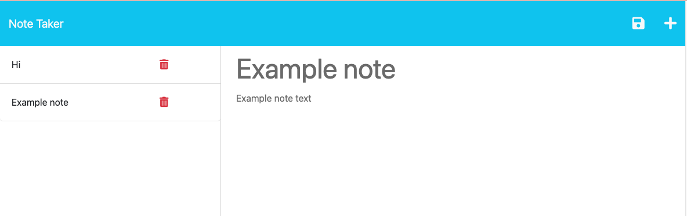

# Note Taker Module 11

## Table of Contents

- [Description](#description)
- [Installation](#installation)
- [Usage](#usage)
- [Credits](#credits)
- [License](#license)

## Description

This project is Module 11 challenge of U of U's professional bootcamp. This project uses express.js to take and store notes in a db. Notes can be deleted when no longer needed.

## Installation

N/A

## Usage

[Deployed App here!](https://evening-journey-94056.herokuapp.com/)

[GitHub repository:](https://github.com/Jonochi/note-tracker)

For users to create and store notes. Click the plus button on the top right, or click in the field for Title and Text to add a new note. The notes will be saved on the left side. The user can select the not title to view the text, and select the delete garbage can icon to remove the note. Notes persist across platforms.

Project screenshot:
    

## Credits

N/A
## License

N/A

